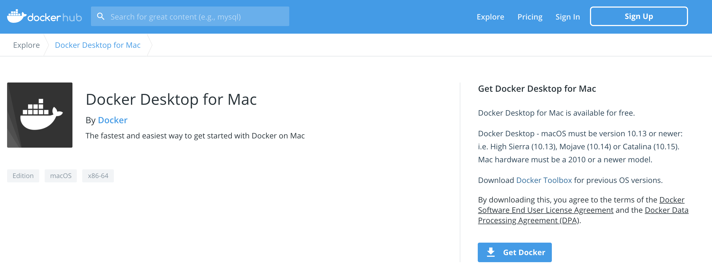
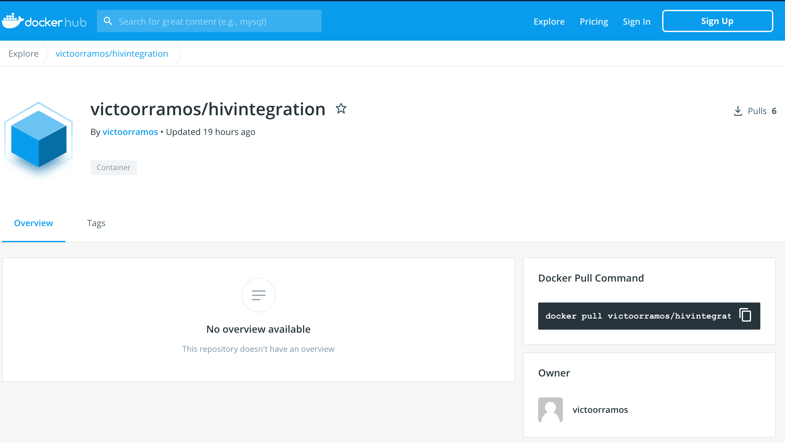
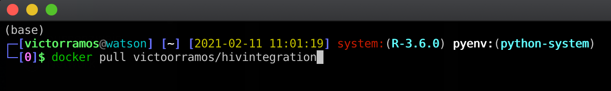
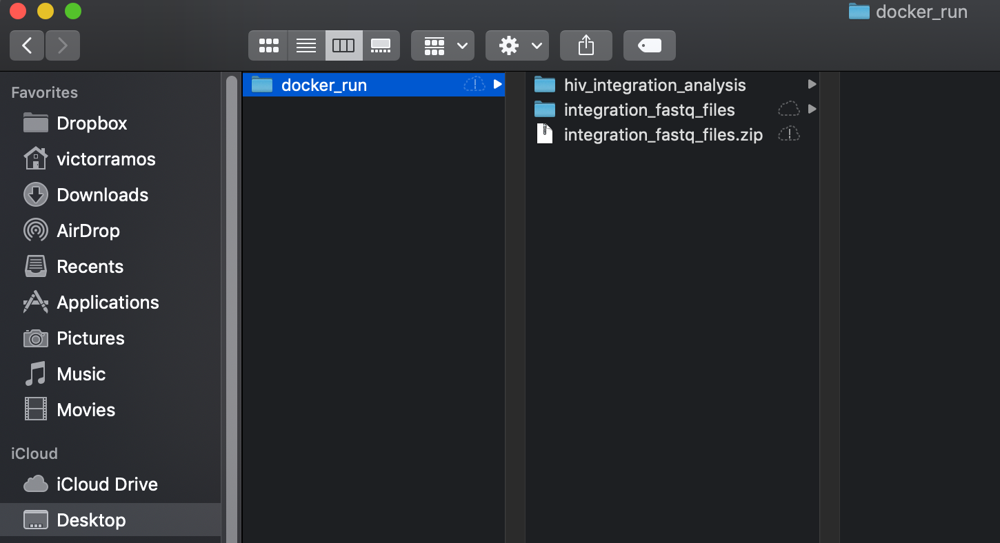
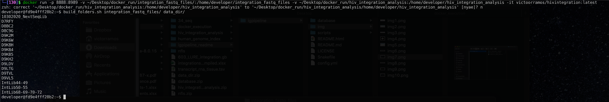
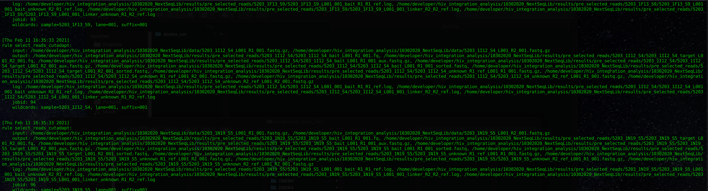
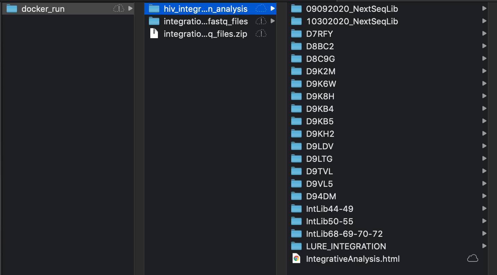

# HIV Integration Analysis

#### Table of Contents  
* [Docker Installation](#installing-docker-desktop-on-macos-and-windows)
* [Docker Execution](#executing-igpipeline)


## Installing Docker Desktop on macOS and Windows

On the official [Docker website](https://www.docker.com/products/docker-desktop), click on the button **"Download for Mac"** for macOS users or **"Download for Windows"** for Windows OS users.


Regardless the selected OS, a new web page will be open and the dmg file can be downloaded clicking on the button **"Get Docker"**



The same web page describes:

## Install it on macOS
Double-click Docker.dmg to start the install process.

When the installation completes and Docker starts, the whale in the top status bar shows that Docker is running, and accessible from a terminal.


## Install it on Windows
Double-click Docker for Windows Installer to run the installer.

When the installation finishes, Docker starts automatically. The whale  in the notification area indicates that Docker is running, and accessible from a terminal.

## Executing HIVIntegration Pipeline
#### Step 1:
Once Docker is installed, download the image containing the HIVIntegration Pipeline on https://hub.docker.com/r/victoorramos/hivintegration
  

Open up a terminal session and download the image using the command **docker pull victoorramos/hivintegration**  
  

<br/>

#### Step 2:
In Desktop, create a folder named "docker_run". Inside this folder, download and extract the zip file* (*available upon request) and create a folder named "hiv_integration_analysis"  
  

<br/>

#### Step 3:
* To load a container with the downloaded image, open up a terminal session and type:
<br/>

```
docker run -p 8888:8989 -v ~/Desktop/docker_run/integration_fastq_files/:/home/developer/integration_fastq_files -v ~/Desktop/docker_run/hiv_integration_analysis:/home/developer/hiv_integration_analysis -it victoorramos/hivintegration:latest
``` 
<br/>

* Right after the container is loaded, we need to create the directory structure needed so the pipeline can be executed. For that, type: 
```
build_folders.sh integration_fastq_files/ data_dir/
```
<br/>

 

<br/>

<br/>

* The shell script execution above will create the file 'run_complete_analysis.sh'. To run the pipeline just execute the shell script.
```
./run_complete_analysis.sh
```
<br/>

That's it ! The HIVIntegration Pipeline is executing.
  

<br/>

#### Step 4:
Once the execution finishes, a html report will be generated in the folder 'hiv_integration_analysis'
  

<br/>


